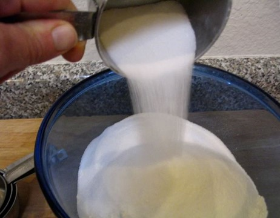
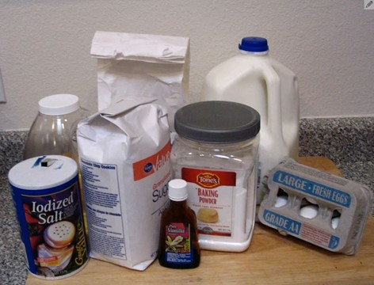
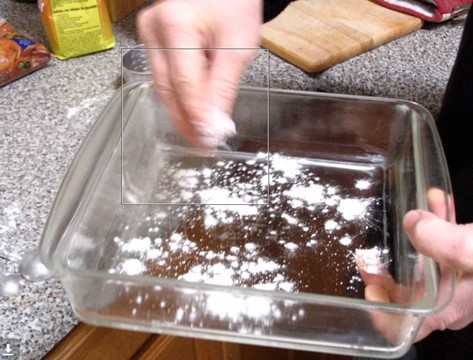
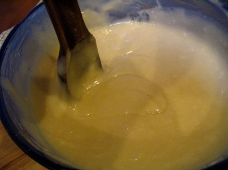
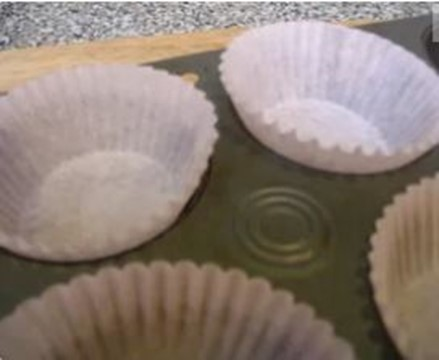
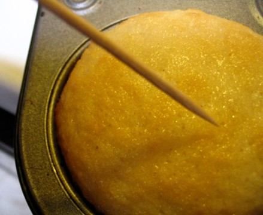
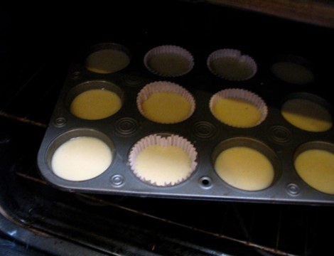
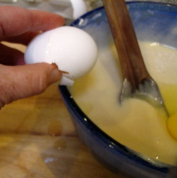

# Cake Time Assignment
**Cake Time Directions:**

The images that follow tell part of the story of making cupcakes, but there are important steps missing and the images are not in order. (The measurements and oven temperature are also missing, but do not worry about that for this exercise.)

As a team, put the images in order and label them figure 1, figure 2, etc. Then, write the directions you think go with each image. In the directions, write "see figure X." After you have done that, write any additional directions you think are missing. Then, put the directions and images in order on the page. Be sure to think about and play around with layout.

Share your final version with another team. Note any differences between the choices each team made.

**Images:**

**Figure 1**

**Figure 2**

**Figure 3**

**Figure 4**

**Figure 5**

**Figure 6**

**Figure 7** 

**Figure 8**

**Figure 9**

Reference:

Linuxmom, [\"How to Make Cake\"](https://www.instructables.com/How-to-make-cake-2/) is licensed under [CC BY-NC-SA 4.0](http://creativecommons.org/licenses/by-nc-sa/4.0)

> 
>
> This work is licensed under the Creative Commons Attribution-NonCommercial 4.0 International License. To view a copy of this license, visit <http://creativecommons.org/licenses/by-nc/4.0/>
>
> or send a letter to Creative Commons, PO Box 1866, Mountain View, CA 94042, USA.

As a team, answer the following questions about another team's cake directions

1.  Check for some basics:

 - Is each figure labeled?

 - Do the text directions refer to each figure?

 - Are the figures and text interspersed (not all the images are at the bottom or top of the page)?

2.  Now, look for more nuanced choices and explain your reaction:

 - How did the team put the directions in order? Are they numbered or do they use page spacing or other ways to show the order? How are they different from your order?

 - What directions did they add? Why? Are those different or the same to the ones you added?

 - What other things do you notice about these directions?

3.  Share your finding with the team that authored these directions.

> This work is licensed under the Creative Commons Attribution-NonCommercial 4.0 International License. To view a copy of this license, visit <http://creativecommons.org/licenses/by-nc/4.0/>
>
> or send a letter to Creative Commons, PO Box 1866, Mountain View, CA 94042, USA.
