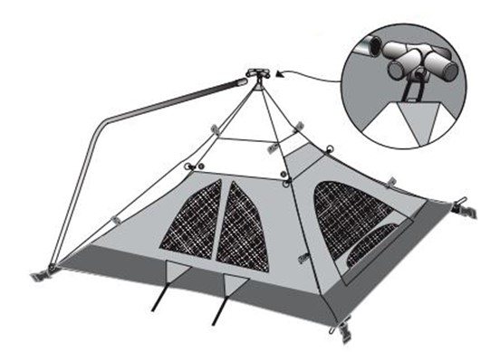

**[Component List:]{.underline}**

-   1 Tent Body,

-   4 Poles,

-   1 Tent Fly,

-   1 Fly Rod,

-   2 Brim Rods,

-   1 Pole Bag,

-   1 Carry Bag,

-   1 Stake Bag w/ Stakes ASSEMBLY

**Directions for Assembly:**

-   Lay the tent body out on the ground and open the door. In windy conditions, the windward corner of the tent should be staked down. Take all of the poles and rods out of the carry bag, assemble them and divide according to their length.

-   One end of each frame pole has a larger diameter. Insert this end onto one of the arms of the spider. Make sure that it seats securely. Improper fit can cause the spider to break.

-   Follow the seam from the spider, down to the corner of the tent. Make sure that the spider is properly oriented, then insert the pin on the corner ring into the other end of the pole.

-   Insert the next pole onto the opposite arm on the spider. Tension this assembly by placing the corner pin in the other end of this pole. With the assembly on the ground, place a third pole into the spider and place the corner pin in the other end. Lift the spider and insert the last pole. Apply tension by inserting the corner pin into the end of this pole.

-   Connect all clips and rings to the frame.

-   Lay the fly out on the ground, upside down. Thread the brim rods through the sleeves on the fly. Fit the fly rod into the web pockets on the underside of the fly and secure with the Velcro tab at the center.

-   Turn the fly right side up and drape it over the tent with a brim rod over each door. Wrap and secure the Velcro straps around the poles to keep the fly in place. Insert each end of a brim rod into the corresponding grommet on the tent. Set the hoods to the same height. If the fly has shifted, adjust the Velcro straps on the frame. Fasten the side release buckles at all of the corners and tension until wrinkles are gone. 8. Stake out the tent through the corner rings. Stake opposite corners while applying tension to square the tent and remove wrinkles from the floor. Stake out the fly through the rings on the side of the fly. Stake down the side pull outs to provide maximum floor space.

Reference:

> Coleman, Inc, ["Tent Setup Instructions, Model 2000004559"](https://images-eu.ssl-images-amazon.com/images/I/A1IqnG4BI%2BS.pdf) is included with permission.
>
>
> This work is licensed under the Creative Commons Attribution-NonCommercial 4.0 International License. To view a copy of this license, visit <http://creativecommons.org/licenses/by-nc/4.0/>
>
> or send a letter to Creative Commons, PO Box 1866, Mountain View, CA 94042, USA.
