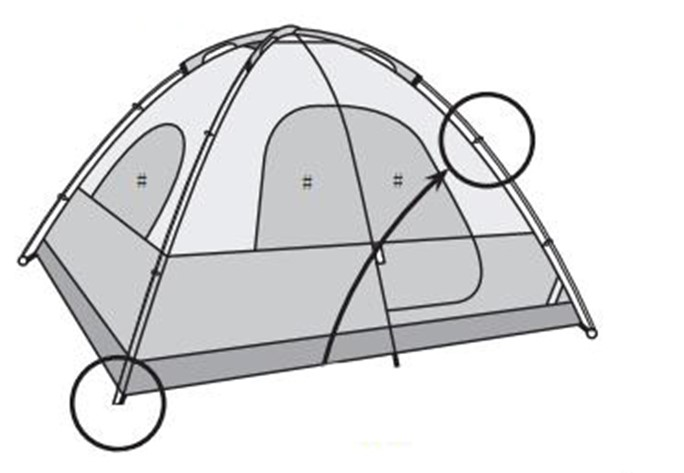
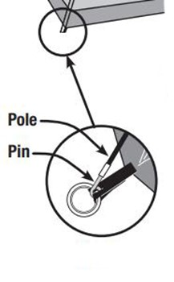
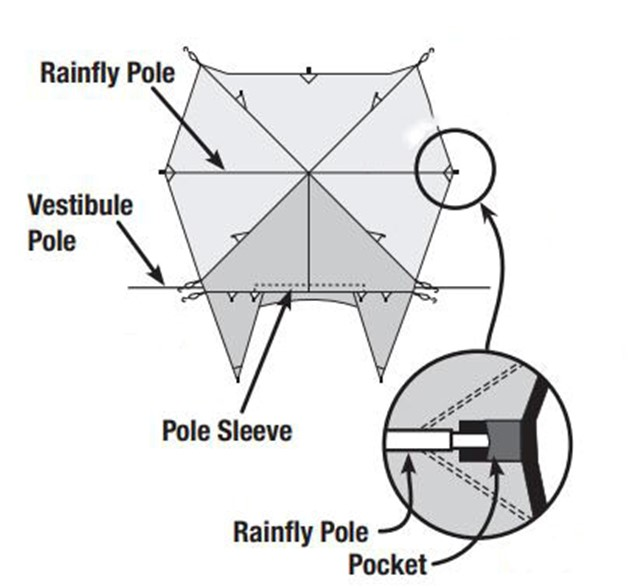
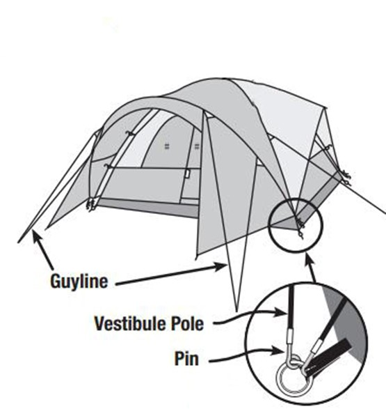

**[Directions for Assembly:]{.underline}**

> Layout & Positioning of Tent and Poles

-   Layout and position the tent with door facing desired direction.

-   Stake down tent corners first through the stake rings.

-   Keep the floor taut.

-   Stake down the remainder of the stake rings.

-   Assemble all poles by unfolding and interlocking the shock-corded pole sections.

-   Insert the body poles into the pole sleeves.

> Connect Poles to Tent

-   Insert one pin into one end of the pole.

-   Go to opposite end of pole and carefully insert the pin into the other pole end.

-   Repeat for all poles.

> Attach Tent to Body Poles Using Clips

-   Attach clips along the edges of tent to body poles.

-   Make any adjustments to the tent stakes, if needed.

> 4 Attach Rainfly

-   Insert vestibule pole into pole sleeve located on underside of rainfly.

-   Attach rainfly pole to underside of rainfly with straps and insert the tips of the rainfly pole into the pockets on underside of rainfly.

-   Drape rainfly over tent.

-   Secure rainfly with straps located on the underside of rainfly.

-   Insert one pin into one end of the vestibule pole.

-   Attach and stake out guylines.

Reference

> Eureka! ["Assembly Instruction for the Titan Tent"](https://www.eurekacamping.com/sites/eurekacamping_site/files/Archive/TITAN09IM.pdf) is included on the basis of fair use.

>
> This work is licensed under the Creative Commons Attribution-NonCommercial 4.0 International License. To view a copy of this license, visit <http://creativecommons.org/licenses/by-nc/4.0/>
>
> or send a letter to Creative Commons, PO Box 1866, Mountain View, CA 94042, USA.
