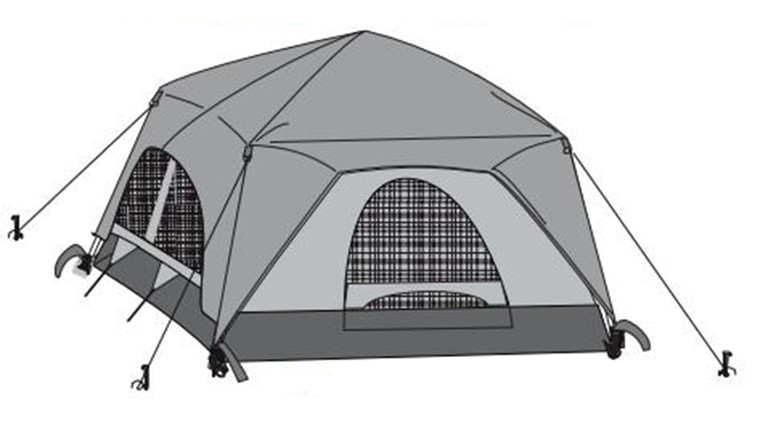
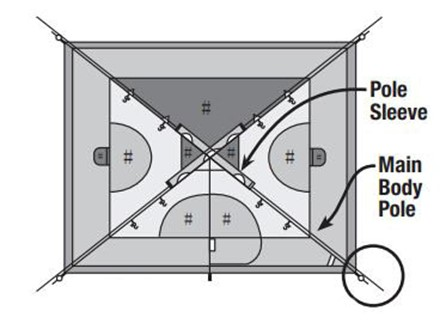

# Tent Assignment
**Component List:**

-   1 Tent Body,

-   4 Poles,

-   1 Tent Fly,

-   1 Fly Rod,

-   2 Brim Rods,

-   1 Pole Bag,

-   1 Carry Bag,

-   1 Stake Bag w/ Stakes ASSEMBLY

**Directions for Assembly:**

-   Lay the tent body out on the ground and open the door. In windy conditions, the windward corner of the tent should be staked down. Take all of the poles and rods out of the carry bag, assemble them and divide according to their length.

-   One end of each frame pole has a larger diameter. Insert this end onto one of the arms of the spider. Make sure that it seats securely. Improper fit can cause the spider to break.

-   Follow the seam from the spider, down to the corner of the tent. Make sure that the spider is properly oriented, then insert the pin on the corner ring into the other end of the pole.

-   Insert the next pole onto the opposite arm on the spider. Tension this assembly by placing the corner pin in the other end of this pole. With the assembly on the ground, place a third pole into the spider and place the corner pin in the other end. Lift the spider and insert the last pole. Apply tension by inserting the corner pin into the end of this pole.

-   Connect all clips and rings to the frame.

-   Lay the fly out on the ground, upside down. Thread the brim rods through the sleeves on the fly. Fit the fly rod into the web pockets on the underside of the fly and secure with the Velcro tab at the center.

-   Turn the fly right side up and drape it over the tent with a brim rod over each door. Wrap and secure the Velcro straps around the poles to keep the fly in place. Insert each end of a brim rod into the corresponding grommet on the tent. Set the hoods to the same height. If the fly has shifted, adjust the Velcro straps on the frame. Fasten the side release buckles at all of the corners and tension until wrinkles are gone. 8. Stake out the tent through the corner rings. Stake opposite corners while applying tension to square the tent and remove wrinkles from the floor. Stake out the fly through the rings on the side of the fly. Stake down the side pull outs to provide maximum floor space.

Reference:

> Coleman, Inc, ["Tent Setup Instructions, Model 2000004559"](https://images-eu.ssl-images-amazon.com/images/I/A1IqnG4BI%2BS.pdf) is included with permission.
>
>
> This work is licensed under the Creative Commons Attribution-NonCommercial 4.0 International License. To view a copy of this license, visit <http://creativecommons.org/licenses/by-nc/4.0/>
>
> or send a letter to Creative Commons, PO Box 1866, Mountain View, CA 94042, USA.
>
**Directions for Assembly:**

> Layout & Positioning of Tent and Poles

-   Layout and position the tent with door facing desired direction.

-   Stake down tent corners first through the stake rings.

-   Keep the floor taut.

-   Stake down the remainder of the stake rings.

-   Assemble all poles by unfolding and interlocking the shock-corded pole sections.

-   Insert the body poles into the pole sleeves.

> Connect Poles to Tent

-   Insert one pin into one end of the pole.

-   Go to opposite end of pole and carefully insert the pin into the other pole end.

-   Repeat for all poles.

> Attach Tent to Body Poles Using Clips

-   Attach clips along the edges of tent to body poles.

-   Make any adjustments to the tent stakes, if needed.

> 4 Attach Rainfly

-   Insert vestibule pole into pole sleeve located on underside of rainfly.

-   Attach rainfly pole to underside of rainfly with straps and insert the tips of the rainfly pole into the pockets on underside of rainfly.

-   Drape rainfly over tent.

-   Secure rainfly with straps located on the underside of rainfly.

-   Insert one pin into one end of the vestibule pole.

-   Attach and stake out guylines.

Reference

> Eureka! ["Assembly Instruction for the Titan Tent"](https://www.eurekacamping.com/sites/eurekacamping_site/files/Archive/TITAN09IM.pdf) is included on the basis of fair use.

>
> This work is licensed under the Creative Commons Attribution-NonCommercial 4.0 International License. To view a copy of this license, visit <http://creativecommons.org/licenses/by-nc/4.0/>
>
> or send a letter to Creative Commons, PO Box 1866, Mountain View, CA 94042, USA.
>

# Tent Assignment
Look at your partner's work, and answer the following questions:

1.  Check for some basics:

 - Is each figure labeled?

 - Do the text directions refer to each figure?

 - Are the figures and text interspersed (not all the images are at the bottom or top of the page)?

2.  Now, look for more nuanced choices and explain your reaction:

 - How closely do the spirit of the images that you or your partner created match those of the official directions? (No weighing in on artistic ability.) What are the main differences? Why do you think those differences exist?

 - How closely does the text directions that you or your partner created match those of the official directions? What are the main differences? Why do you think those differences exist?

 - What other major differences exist between your two sets of directions? If you were going to create one document from your two, what choices would you make to include some of each of your work (without defaulting to the official directions)? Why?

 - What other things do you notice about the two sets of directions?

3.  Share your finding with your partner. Decide which aspects of each set of directions you would include to make a new draft of "official" directions. Be able to explain why.

> This work is licensed under the Creative Commons Attribution-NonCommercial 4.0 International License. To view a copy of this license, visit <http://creativecommons.org/licenses/by-nc/4.0/>
>
> or send a letter to Creative Commons, PO Box 1866, Mountain View, CA 94042, USA.

