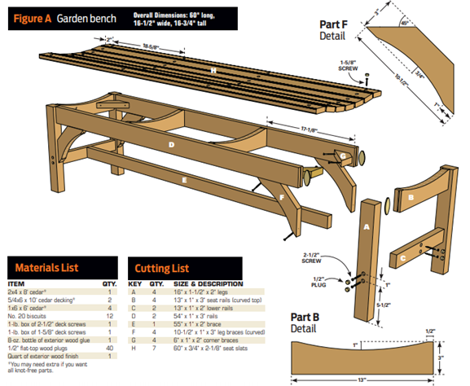
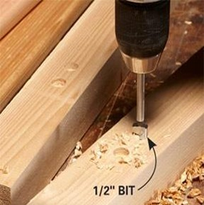
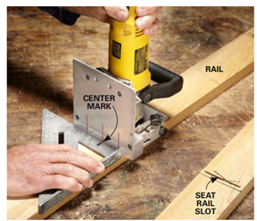
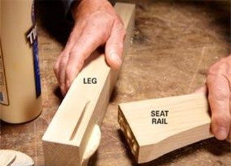
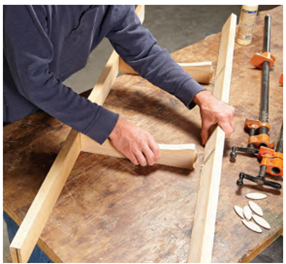
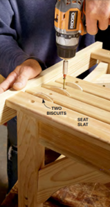
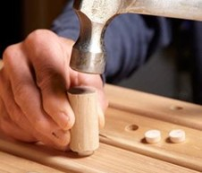
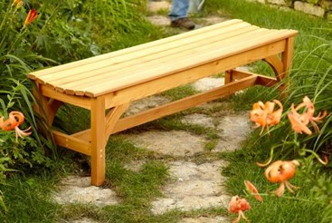

**[Materials Required]**

-   2x4 x 8' cedar

-   5.4x6 x 10 cedar decking (2)

-   1x6 x 6' cedar (4)

-   No. 20 biscuits (12)

-   2-1/2" deck screws

-   1-5/8" deck screws

-   Wood glue

-   ½" flattop wood plugs (40)

-   Exterior wood finish

**[Directions for Assembly]**

> Cut out and drill the parts

-   Use a 1/2-in. Forstner bit to drill recesses for the screws.

-   Cut the biscuit slots for the seat rails: Mark the centers of the biscuit slots on masking tape. Then, with the plug recesses facing up, cut the slots in the narrow sides of the legs. Keep the plate joiner and leg tight to the bench top as you cut. Use tape to avoid marks on the wood and to keep track of the orientation of the pieces.

-   Position slots for the long rails with a spacer: Orient the leg so the previously cut slot is facing up, and cut a slot on the side opposite the plug holes. Use a spacer to position the slot so the long rail will be centered on the leg when it's installed.

-   Cut slots in the rail ends: Mark the centers of the curved seat rails and long rails on masking tape.

-   Cut slots in the long rails: Position the long rails with the masking tape facing down. Use a Speed Square as a guide for cutting biscuit slots for the intermediate rails. Align the square with the edge mark for the seat rail. Make a center mark on the square as a reference for lining up the plate joiner.

> Join the rails and legs with biscuits

-   Put a biscuit in the slot and dry-fit the leg and seat rail to make sure the rail is oriented correctly. It should be centered on the leg. Then spread glue in the slots and on the biscuit and press the leg and the seat rail together.

> Complete the leg assembly and seat assemblies

-   Use a spacer to support the lower rail. Then drive screws through the legs into the rail.

-   Connect the seat rails with biscuits Join the two long rails with the two intermediate seat rails with biscuits and glue. Clamp them and let the glue set about 30 minutes.

-   Connect the leg assembies to the seat assembly with biscuits and clamp them together. Then attach the brace with screws.

-   SCREW ON THE SEAT SLATS Start by attaching the two outside slats. Then center the middle slat and attach it with screws. Next, position the remaining slats so there's an even space (two biscuits wide) between them. Use a board to align the slat ends

> Finishing Touches

-   HIDE THE SCREWS WITH WOOD PLUGS Glue flat-top wood plugs into the plug recesses. Use a cutoff dowel or a small block of wood to pound them flush.

```{=html}
<!-- -->
```
-   Finished the bench with Cabot Australian Timber Oil.

Reference:

> Family Handyman ["How to Build a Garden Bench"](https://www.familyhandyman.com/project/how-to-build-a-garden-bench/) and ["How to Build a Patio Chair"](https://www.familyhandyman.com/project/how-to-build-a-patio-chair/) are included on the basis of fair use.

 














>
> This work is licensed under the Creative Commons Attribution-NonCommercial 4.0 International License. To view a copy of this license, visit <http://creativecommons.org/licenses/by-nc/4.0/>
>
> or send a letter to Creative Commons, PO Box 1866, Mountain View, CA 94042, USA.
